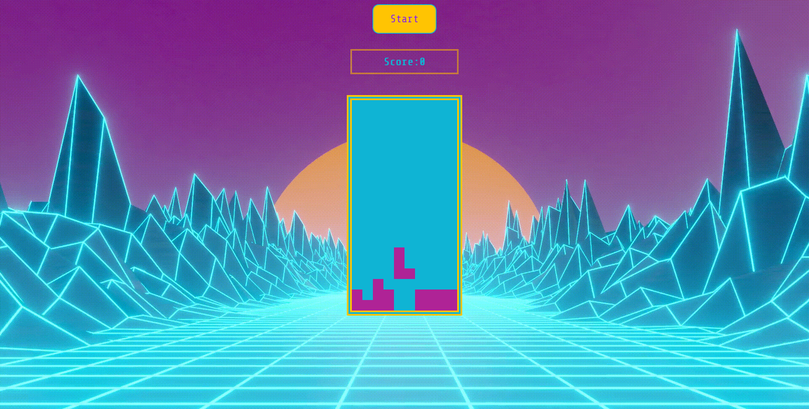
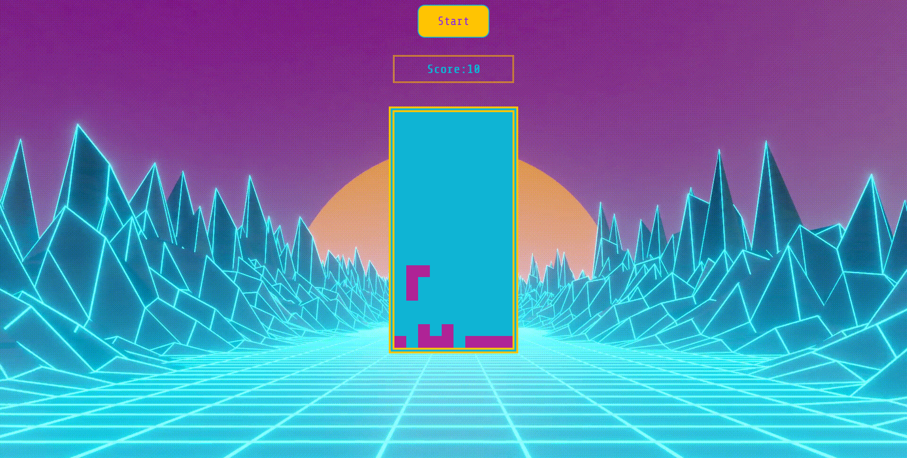
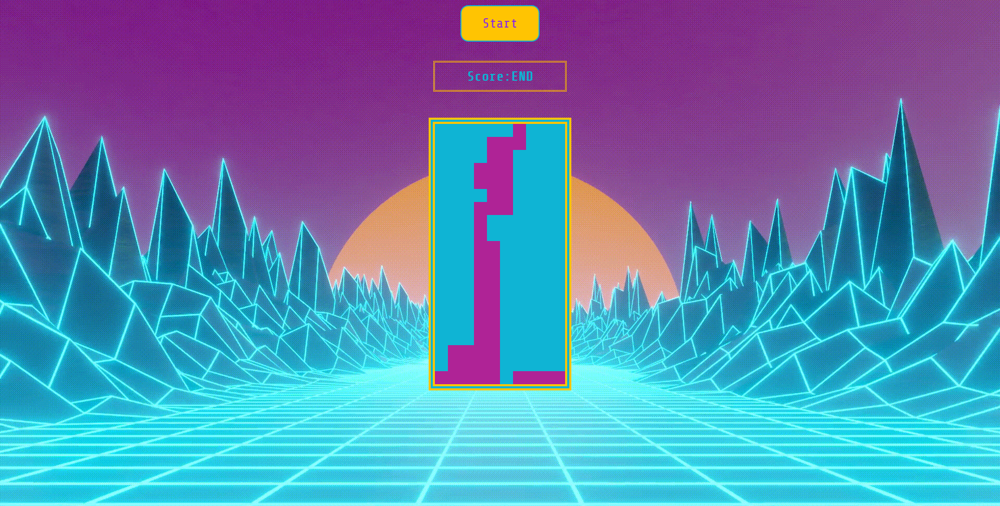

# GA Project 1

Project Overview: Tetris


Game Objective:

Accumulate points by stacking tetrominos until they form a complete line without gaps. Once the line is formed it will vanish to award points.





Requirements:
Vanilla JS, HTML, CSS.

Personal Objecgtives:

1. Display understanding of basic JS, HTML and CSS skills otherwise learned through Unit1.

2. Troubleshoot problems, learn problem-solving skills and experiment with different solutions for multiple effects.

Gameplay:

Manipulate the tetrominos by using the arrow keys on the keyboard to fit or stack them into/onto one another.

1. "<" left key to move left,

2. ">" right key to move right,

3. "\/" down key to move downward and

4. "^" up key to rotate the tetrominos.

Game ends when any stack reaches the top of the grid.



Interesting Bit:

Drawing the tetrominos and its different positions for rotation via iteration.

```
 const w = 10;

  const ohTetro = [
    [0, 1, w, w + 1],
    [0, 1, w, w + 1],
    [0, 1, w, w + 1],
    [0, 1, w, w + 1],
  ];

  const eyeTetro = [
    [1, w + 1, w * 2 + 1, w * 3 + 1],
    [w, w + 1, w + 2, w + 3],
    [1, w + 1, w * 2 + 1, w * 3 + 1],
    [w, w + 1, w + 2, w + 3],
  ];

  const zeeTetro = [
    [w, w + 1, w * 2 + 1, w * 2 + 2],
    [2, w + 1, w + 2, w * 2 + 1],
    [w, w + 1, w * 2 + 1, w * 2 + 2],
    [2, w + 1, w + 2, w * 2 + 1],
  ];

  const esTetro = [
    [w + 1, w + 2, w * 2, w * 2 + 1],
    [0, w, w + 1, w * 2 + 1],
    [w + 1, w + 2, w * 2, w * 2 + 1],
    [0, w, w + 1, w * 2 + 1],
  ];

  const jayTetro = [
    [1, w + 1, w * 2 + 1, w * 2],
    [w, w * 2, w * 2 + 1, w * 2 + 2],
    [1, w + 1, w * 2 + 1, 2],
    [w, w + 1, w + 2, w * 2 + 2],
  ];

  const elTetro = [
    [1, w + 1, w * 2 + 1, w * 2 + 2],
    [w + 2, w * 2, w * 2 + 1, w * 2 + 2],
    [1, 2, w + 2, w * 2 + 2],
    [0, 1, 2, w],
  ];

  const teeTetro = [
    [1, w, w + 1, w + 2],
    [1, w + 1, w + 2, w * 2 + 1],
    [w, w + 1, w + 2, w * 2 + 1],
    [1, w, w + 1, w * 2 + 1],
  ];

```

Visually it's like this

```

    #    #    #     #

#   0    1    2     3


#   w   w+1   w+2   w+3


#   w2  w2+1  w2+2  w2+3


#   w3  w3+1  w3+2  w3+3

```

Hardest bit:

Finding out that stacking the shapes require exiting the travel function by continuing with a spawn function in the same freeze function. If not it would carry on travelling into the unknown.

```
 function tetOnIce() {
    if (
      currentSpawn.some(
        (index) =>
          sqArr[currentPos + index + w].classList.contains("stop-here") ||
          stayAway(currentPos + w)
      )
    ) {
      currentSpawn.forEach((index) =>
        sqArr[currentPos + index].classList.add("stop-here")
      );

      // create new tetromino and stop the above
      randoTetro = nextRandom;
      nextRandom = Math.floor(Math.random() * tetroMinos.length);
      currentSpawn = tetroMinos[randoTetro][currentRot];
      currentPos = 4;
      tetroSpawn();
      addScore();
      gameOver();
    }
  }
```

Future considerations:
Maybe come back to this after ReactJS, or even also afgter Unit3 and 4.